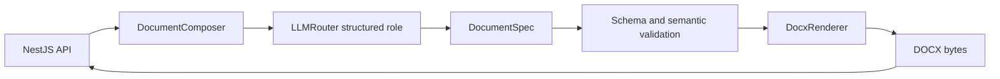

# 通用文档生成

> 状态：MVP 实现设计。本文定义 ai-service 的领域无关文档组合与 DOCX 渲染能力，不定义周报、简报等业务流程。

## 1. 目标与边界

ai-service 接收可信内部服务提供的生成指令和纯文本材料，生成受控 `DocumentSpec`，并可将其确定性渲染为 DOCX。NestJS 仍负责认证、租户、权限、额度、任务生命周期、正式文件登记、COS 写入和业务审计。

桌面端、移动端和第三方客户端不得直接调用文档内部接口。ai-service 不读取业务数据库，不持有 COS 长期凭据，不把生成结果登记为正式业务资源。

第一版不处理上传文件、OCR、RAG、图片、图表、宏、任意 OOXML、任意模板路径和外部关系。上传材料应先由后续文件处理链转换为经过权限过滤的纯文本。

## 2. 处理流程

`DocumentComposer` 在进程内直接复用 `LLMRouter`，不通过 HTTP 回调本服务的 `/invoke`。模型只生成语义结构，`DocxRenderer` 不调用模型。同一个 `DocumentSpec` 和 `template_id` 必须得到语义一致的 DOCX。

## 3. DocumentSpec

`DocumentSpec` 是版本化中间表示，第一版 `schema_version` 固定为 `1.0`。支持标题、副标题、一级至三级章节，以及以下块：

- paragraph；
- bullet_list；
- numbered_list；
- table；
- quote；
- page_break。

Schema 禁止额外字段并限制章节、块、表格与文本长度。表格每一行的单元格数量还必须与列数量相同。`source_refs` 只能引用本次请求中提供的材料 ID；未引用全部材料是允许的，引用不存在的材料会被拒绝。

## 4. 内部接口

- `POST /internal/v1/documents/compose`：生成并返回 `DocumentSpec` 与模型执行元数据；
- `POST /internal/v1/documents/render-docx`：不调用模型，将请求中的 `DocumentSpec` 返回为 DOCX；
- `POST /internal/v1/documents/generate-docx`：组合前两步，一次返回 DOCX。

所有接口要求 `X-AI-Internal-Token`。DOCX 使用标准 MIME 类型返回，不嵌入 JSON 或 Base64。调用方通过 `AbortSignal` 或断开 HTTP 请求取消不再需要的生成。

`compose` 和 `generate-docx` 固定使用 `structured` 模型角色。调用方可选择该角色白名单中的 profile，但不能覆盖 Provider、模型地址、密钥或重试策略。

当 structured profile 使用 DeepSeek V4 与 `function_calling` 时，ai-service 会关闭该次调用的 thinking 模式，因为 DeepSeek thinking 与强制 `tool_choice` 不兼容。该行为只影响结构化调用，不改变通用文本或流式调用的 thinking 行为。

## 5. 失败语义

- 输入材料与指令总 UTF-8 大小超过 256 KiB：`INVALID_DOCUMENT_REQUEST`，HTTP 422；
- `DocumentSpec` 不满足 Schema 或语义约束：`DOCUMENT_SPEC_INVALID`，HTTP 502（模型生成）或 422（调用方提交）；
- Provider `finish_reason=length`：`DOCUMENT_GENERATION_TRUNCATED`，HTTP 502，不渲染部分结果；
- 模板不在契约白名单：请求校验失败，HTTP 422；
- Provider 或服务不可用：沿用通用 LLM 错误与回退语义。

## 6. DOCX 安全与样式

第一版模板 `business-standard` 使用 A4、固定页边距、受控中文字体、标题层级、段落、列表和表格样式。文件名由标题清理得到，响应同时提供安全的 ASCII fallback 和 RFC 5987 UTF-8 文件名。

渲染器不接受文件路径、模板文件、XML、宏、链接关系或任意样式字典。目录使用 Word TOC 字段，内容由 Word 或兼容软件打开时更新。

## 7. 验收口径

- compose 输出通过正式 OpenAPI `DocumentSpec` 校验；
- `finish_reason=length` 不产生 DOCX；
- render-docx 不调用 LLM；
- 生成文件可由 `python-docx` 重新打开，标题、章节、列表和表格内容正确；
- 不存在的 `source_refs` 和列数不一致的表格被拒绝；
- 三个接口均验证内部 Token，契约生成物无漂移。
