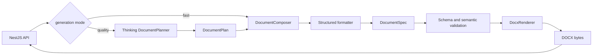

# 通用文档生成

> 状态：DOCX/PDF/PPTX 已实现；PDF/PPTX 多模板、矢量装饰与图文版式于 2026-09-21 落地。本文定义 ai-service 的领域无关文档组合与确定性渲染能力，不定义周报、简报等业务流程；NestJS 侧的正式资源落地链路（generate_document 工具 → compose 生成 DocumentSpec → Markdown 落库 → ManagedDocument/AIActionDraft/审计）已随 AI 助手工具循环落地（2026-09-11），见 [AI 助手工具循环](assistant-tool-loop.md)。

## 1. 目标与边界

ai-service 接收可信内部服务提供的生成指令和纯文本材料，生成受控 `DocumentSpec`，并可将其确定性渲染为 DOCX。NestJS 仍负责认证、租户、权限、额度、任务生命周期、正式文件登记、COS 写入和业务审计。

桌面端、移动端和第三方客户端不得直接调用文档内部接口。ai-service 不读取业务数据库，不持有 COS 长期凭据，不把生成结果登记为正式业务资源。

当前版本支持受控 `ImageBlock` 图片嵌入，但不允许任意模板路径、任意 OOXML、宏或未授权外部关系。图片必须来自调用方有权读取的 COS 签名 URL、HTTP(S) URL 或受限 data URL；渲染器不会凭空生成不相关配图。

文档规格落库时使用 `cos://{objectKey}` 稳定图片引用。NestJS 在生成文件和公开导出 DOCX/PDF/PPTX 前读取已授权的 COS 对象，并转换为内联 `data:` URL 后交给 ai-service，确保内部渲染服务不需要直接访问私有 COS 域名；图片字节会实际嵌入最终文件，无法读取对象时才降级为占位说明。

已生成文件通过 `GET /api/v1/documents/{documentId}/file` 直接返回已授权的文件字节，不跳转 COS。下载文件名由文档标题和关联文件 MIME 类型确定，客户端必须拒绝 0 字节响应。生成 XLSX 时优先使用当前轮上传的表格；当前轮没有附件时，按会话回退到最近可访问的 Excel/CSV 或此前生成的 XLSX，且不会覆盖原文件。

## 1.1 PDF/PPTX 模板体系

| 模板 ID | 中文名 | 视觉方向 | 适用场景 |
| --- | --- | --- | --- |
| `editorial-modern` | 现代图文 | 青绿色主色、暖橙强调、浅色封面、图文分栏 | 默认；方案、讲义、报告 |
| `business-standard` | 稳重商务 | 品牌紫、规整标题与表格 | 制度、正式材料、通用商务 |
| `executive-dark` | 深色高管 | 深色封面、金色强调、浅色正文 | 高管汇报、经营复盘、路演 |
| `product-story` | 产品叙事 | 玫红主色、橙色强调、发布会式封面 | 产品发布、路线图、市场叙事 |
| `academic-clean` | 研究报告 | 学术蓝、青色强调、清晰留白 | 研究报告、数据分析、方案评审 |
| `minimal-mono` | 极简黑白 | 黑白灰层级、低装饰、强版式 | 打印、归档、正式简报 |

PDF/PPTX 默认使用 `editorial-modern`；桌面文档编辑器导出时可以切换六种模板。DOCX 接受相同模板 ID，但当前继续共用稳定 Word 样式。

PPTX 封面和正文装饰均使用 PowerPoint 原生形状，包含色块、圆形、菱形、侧边栏和角标，可在 Office 中继续编辑。页面同时包含文字与图片时自动采用左文右图布局；没有图片时仍保留矢量构图，不再是纯文字白页。

## 2. 处理流程

`DocumentPlanner` 与 `DocumentComposer` 在进程内直接复用 `LLMRouter`，不通过 HTTP 回调本服务的 `/invoke`。模型只生成语义结构，`DocxRenderer` 不调用模型。同一个 `DocumentSpec` 和 `template_id` 必须得到语义一致的 DOCX。

`generation_mode=fast` 直接生成 `DocumentSpec`，保持单次模型调用和既有延迟、成本。`generation_mode=quality` 先通过 reasoning 角色生成并校验 `DocumentPlan`，再关闭 structured formatter 的 thinking，将计划扩写为严格 `DocumentSpec`。compose 响应在 quality 模式下返回 `plan` 和 `planning_execution`；fast 模式下两者为 `null`。

quality Planner 只保留最终 JSON 计划，不保存或返回 Provider 的 chain-of-thought。DeepSeek 默认使用 `planning_reasoning_effort=low` 和独立的 `planning_max_output_tokens=2048`，调用方可选择 high 或 max，但必须为更长推理预留足够预算。

## 3. DocumentSpec

`DocumentSpec` 是版本化中间表示，第一版 `schema_version` 固定为 `1.0`。支持标题、副标题、一级至三级章节，以及以下块：

- paragraph；
- bullet_list；
- numbered_list；
- table；
- quote；
- page_break。

Schema 禁止额外字段并限制章节、块、表格与文本长度。表格每一行的单元格数量还必须与列数量相同。`source_refs` 只能引用本次请求中提供的材料 ID；未引用全部材料是允许的，引用不存在的材料会被拒绝。

## 4. 内部接口

- `POST /internal/v1/documents/compose`：生成并返回 `DocumentSpec` 与模型执行元数据；
- `POST /internal/v1/documents/render-docx`：不调用模型，将请求中的 `DocumentSpec` 返回为 DOCX；
- `POST /internal/v1/documents/generate-docx`：组合前两步，一次返回 DOCX。

所有接口要求 `X-AI-Internal-Token`。DOCX 使用标准 MIME 类型返回，不嵌入 JSON 或 Base64。调用方通过 `AbortSignal` 或断开 HTTP 请求取消不再需要的生成。

`compose` 和 `generate-docx` 固定使用 `structured` 模型角色。调用方可选择该角色白名单中的 profile，但不能覆盖 Provider、模型地址、密钥或重试策略。

当 structured profile 使用 DeepSeek V4 与 `function_calling` 时，ai-service 会关闭该次调用的 thinking 模式，因为 DeepSeek thinking 与强制 `tool_choice` 不兼容。该行为只影响结构化调用，不改变通用文本或流式调用的 thinking 行为。

## 5. 失败语义

- 输入材料与指令总 UTF-8 大小超过 256 KiB：`INVALID_DOCUMENT_REQUEST`，HTTP 422；
- Planner 未返回合法 `DocumentPlan`：`DOCUMENT_PLAN_INVALID`，HTTP 502；
- Planner 达到 token 上限：`DOCUMENT_PLANNING_TRUNCATED`，HTTP 502，不进入 structured formatter；
- `DocumentSpec` 不满足 Schema 或语义约束：`DOCUMENT_SPEC_INVALID`，HTTP 502（模型生成）或 422（调用方提交）；
- Provider `finish_reason=length`：`DOCUMENT_GENERATION_TRUNCATED`，HTTP 502，不渲染部分结果；
- 模板不在契约白名单：`template_id` 枚举校验失败，返回 `INVALID_INVOCATION_REQUEST` / `Request validation failed`，HTTP 422；
- Provider 或服务不可用：沿用通用 LLM 错误与回退语义。

> 排障：导出返回 `422 INVALID_INVOCATION_REQUEST`（`Request validation failed`）且请求里带了新增模板
> （如 `editorial-modern`）时，通常是**运行中的 ai-service 是旧进程**，其生成的 `TemplateId` 枚举还不含该模板，
> 而不是 `DocumentSpec` 数据有问题——同一个 `DocumentSpec` 用已知模板重试会成功。重启 ai-service
> （`scripts/start-ai-dev.ps1` 绑定 `AI_SERVICE_URL` 端口，并在端口被占用时直接报错）后重试即可。
> Pydantic 的具体字段错误只记录在 ai-service 服务端日志（`request validation failed ... errors=...`），
> 对外响应刻意不含字段细节。

## 6. DOCX 安全与样式

第一版模板 `business-standard` 使用 A4、固定页边距、受控中文字体、标题层级、段落、列表和表格样式。文件名由标题清理得到：按「落库 `title` → `DocumentSpec.title` → `document`」取值，去除文件系统非法字符并截断，响应同时提供安全的 ASCII fallback（`document.<ext>`）和 RFC 5987 UTF-8 文件名 `filename*=UTF-8''...`；同一标题也用作封面标题，详见 `docs/architecture/generated-document-format-delivery.md`。

渲染器不接受文件路径、模板文件、XML、宏、链接关系或任意样式字典。目录使用 Word TOC 字段，内容由 Word 或兼容软件打开时更新。

## 7. 验收口径

- compose 输出通过正式 OpenAPI `DocumentSpec` 校验；
- quality compose 先产生合法 `DocumentPlan`，并返回独立规划执行元数据；
- fast compose 保持单次模型调用；
- `finish_reason=length` 不产生 DOCX；
- render-docx 不调用 LLM；
- 生成文件可由 `python-docx` 重新打开，标题、章节、列表和表格内容正确；
- 不存在的 `source_refs` 和列数不一致的表格被拒绝；
- 三个接口均验证内部 Token，契约生成物无漂移。

## 8. NestJS 侧落地说明（2026-09-11）

- 公开入口是 `generate_document` 工具执行器（`apps/api/src/assistant/tools/executors/generate-document.tool.ts`），经 ToolRegistry/ToolPolicy 批准后调用 `DocumentService.createGeneratedDocument`，无独立公开 HTTP 接口；
- `DocumentService`（`apps/api/src/document`）新增 AI 生成链路：网关 `composeDocument` 调用 `POST /internal/v1/documents/compose`（固定 `generation_mode=fast`、`locale=zh-CN`）→ NestJS 把 `DocumentSpec` 序列化为 Markdown 文本 → 同一事务内写 Resource(DOCUMENT)、ManagedDocument、AIActionDraft（`status=EXECUTED`，actionType 与权限码一致的 `ai.document.generate`）、AuditLog（`DOCUMENT_GENERATED`）→ 返回文档 ID 给 ToolResult；
- 幂等以 `tool_call_id` 为边界：重复执行直接回放已落库文档，不重复生成；
- AI 生成文档与手工创建文档同构（同一张 `managed_documents` 表、同一 Resource 归属与 ACL 语义），读取/修改/删除沿用既有 `GET/PATCH/DELETE /documents/:documentId` 与 `document.read/update/delete` 权限；
- 权限码 `ai.document.generate`（调用 AI 生成文档）与既有 RBAC 权限同体系，由管理员经角色授予；
- 暂未接入：`quality` 规划模式、`source_materials` 材料上传（工具执行器固定传空列表）。

## 9. DOCX 渲染导出落地说明（2026-09-14）

- 公开端点 `GET /api/v1/documents/{documentId}/export`（operationId `documentExportDocx`）：读取生成时落库的 `document_spec`，经 ai-service `render-docx` 确定性渲染为 DOCX 返回，不调用 LLM、零 Token；响应为附件下载（标准 DOCX MIME，ASCII fallback 与 RFC 5987 UTF-8 文件名，`Cache-Control: no-store`）；
- 权限：复用 `document.read`——导出是同一文档资源的另一种交付视图而不是独立资源，不新增独立权限码；授权仍走既有 Resource(DOCUMENT) 模型（所有权、`TENANT` 可见性、Membership/ROLE ACL 与 `document.manage_all`）；
- 数据模型：`managed_documents` 新增 `document_spec` JSONB 列（迁移 `0023_document_docx_export`），保存同一次 compose 的 `DocumentSpec` 作为导出事实源，避免导出时二次调用 LLM（成本翻倍且内容可能与落库 Markdown 不一致）；存量文档与手工创建文档该列为空，导出返回明确错误而不猜测内容；
- 手工修改内容（`PATCH /documents/{documentId}` 传 `content`）后 `document_spec` 置空，防止导出内容与库中 Markdown 不一致；
- 网关接入 ai-service 三个文档接口：`composeDocument`（生成链路在用）、`renderDocumentDocx`（业务导出调用）、`generateDocumentDocx`（compose+render 一步，仅透传保留，业务不调用以避免重复 LLM 生成）；
- 桌面端：文档详情提供“导出 DOCX”按钮，经 `downloadDocumentDocx` 复用同一公开端点，文件由浏览器下载；
- 契约：公开契约兼容新增该端点（开发基线 0.22.0 不变），`packages/api-client` 已重新生成；
- 扩展约定：后续新增文档格式（如 PDF）时，在 ai-service 增加对应确定性渲染器与内部端点，NestJS 侧按同一模式增加导出端点，`document_spec` 与权限模型无需变化。
