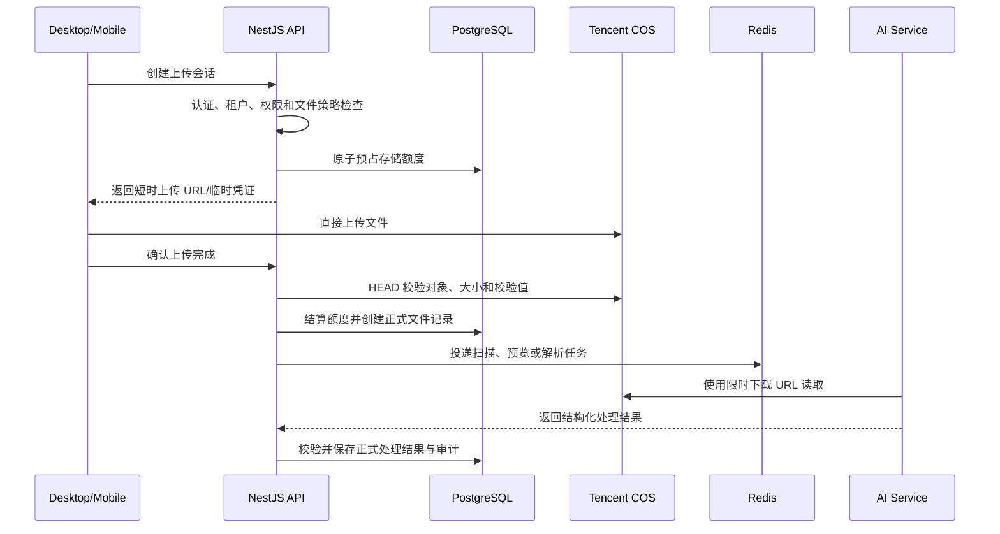

# 文件上传设计草案

> 状态：设计草案，尚未写入 OpenAPI 契约，也尚未实现公开上传接口。本文用于确定边界和实施顺序，不是已经生效的 API 定义。

## 1. 当前结论

- 公开上传 API 必须先修改 `packages/contracts/openapi/openapi.yaml`，完成契约评审后再由 `apps/api` 实现。
- 不需要等待完整 RBAC 管理能力全部完成，但实现公开接口前必须具备最小的认证、租户上下文、上传权限、额度预占和审计能力。
- 当前可以先实现不对外暴露的 COS 适配层、对象键生成规则和文件策略；不得先提供无租户和无额度控制的通用上传接口。
- 文件二进制存储在腾讯云 COS；正式文件元数据、租户归属、业务关联、额度和审计记录由 NestJS/PostgreSQL 管理。
- 客户端直接上传到 COS，NestJS 负责授权和签发短时上传凭证；AI 服务只使用限时下载 URL 或受控内容，不持有长期 COS 密钥。

## 2. COS 布局

当前资源：

```text
Bucket: cees-ai-1403013862
Region: ap-chengdu
```

Bucket 中使用以下顶层对象前缀：

```text
cees/
├── test/   # development 与 test 共用的非生产区域
└── prod/   # production 区域
```

推荐的完整对象键：

```text
cees/{environment}/tenants/{tenantId}/files/{yyyy}/{mm}/{fileId}/source
```

例如：

```text
cees/test/tenants/tenant_123/files/2026/09/file_456/source
cees/prod/tenants/tenant_123/files/2026/09/file_789/source
```

自动化测试应继续增加运行标识，避免清理测试数据时影响开发文件：

```text
cees/test/runs/{testRunId}/tenants/{tenantId}/files/{fileId}/source
```

原始文件名只保存在数据库中，不直接作为 COS 对象键。派生文件放在同一 `fileId` 下：

```text
{fileId}/source
{fileId}/derived/preview.webp
{fileId}/derived/text.json
{fileId}/derived/pages/1.webp
```

对象键中的租户 ID 只用于组织、审计和权限收窄，不能替代 API 的租户授权校验。

## 3. 环境与凭据隔离

development 与 test 都写入 `cees/test`，production 写入 `cees/prod`。同一个 Bucket 下的前缀隔离必须同时由 CAM 权限约束：

- 开发/测试凭据只能访问 `cees/test/*`；
- 生产凭据只能访问 `cees/prod/*`；
- 两套环境不得共享同一 SecretId/SecretKey；
- 长期凭据只注入 NestJS API，不注入桌面端、移动端或 AI 服务。

对应策略模板为 [非生产 CAM 策略](../../infra/tencent-cos/cam-policy.nonprod.example.json) 和 [生产 CAM 策略](../../infra/tencent-cos/cam-policy.prod.example.json)。两者操作集合相同，但授权资源前缀不同。

COS 中的“文件夹”本质上是对象键前缀，因此仅依赖代码拼接前缀并不足以形成安全隔离。

## 4. 服务边界

| 组件 | 职责 |
| --- | --- |
| NestJS API | 认证、租户、权限、上传会话、额度预占、COS 签名、文件元数据、业务关联和审计 |
| 腾讯云 COS | 保存原始文件与派生二进制对象，不作为业务事实源 |
| PostgreSQL | 保存 FileAsset、UploadSession、额度、关联和状态 |
| Redis | 上传限流、短期状态、任务队列和幂等辅助，不作为额度事实源 |
| AI Service | 使用限时 URL 读取已授权文件，返回提取、OCR、分类或切块结果，不直接创建正式文件记录 |
| Desktop/Mobile | 创建上传会话、直传 COS、上报完成状态，不决定租户、对象键或 ACL |

## 5. 推荐上传流程



不推荐所有文件先经过 NestJS 再转发 COS。大文件代理上传会占用 API 带宽、连接数和内存，也不利于移动端断点续传。

建议上传模式：

- 小文件使用限定单一对象键的预签名 PUT URL；
- 大文件使用限定前缀、操作和有效期的 STS 临时凭证或分片签名；
- 契约从第一版保留 `uploadMode`，以便兼容 `single` 与 `multipart`。

## 6. 上传 API 草案

以下路径仅用于设计讨论，正式实现前必须先写入 OpenAPI。

### 6.1 创建上传会话

```http
POST /api/v1/upload-sessions
Idempotency-Key: <client-generated-key>
```

请求示例：

```json
{
  "purpose": "attachment",
  "fileName": "项目方案.pptx",
  "contentType": "application/vnd.openxmlformats-officedocument.presentationml.presentation",
  "sizeBytes": 28377120,
  "sha256": "optional"
}
```

客户端不得提交 `tenantId`、Bucket、对象前缀、完整对象键或 ACL。

响应草案：

```json
{
  "uploadSessionId": "upl_xxx",
  "fileId": "file_xxx",
  "uploadMode": "single",
  "expiresAt": "2026-09-04T12:00:00Z",
  "upload": {
    "method": "PUT",
    "url": "temporary-signed-url",
    "headers": {
      "Content-Type": "application/pdf"
    }
  }
}
```

创建会话时必须完成：

1. 从服务端认证上下文取得用户和租户；
2. 校验上传用途和资源权限；
3. 根据用途、套餐和技术上限校验文件类型与声明大小；
4. 在 PostgreSQL 事务内预占额度；
5. 生成服务端控制的 `fileId` 和 COS 对象键；
6. 签发短时、最小范围的上传权限；
7. 记录上传会话创建审计事件。

### 6.2 完成上传

```http
POST /api/v1/upload-sessions/{uploadSessionId}/complete
```

完成请求只表示“客户端认为上传完成”。API 必须向 COS 查询并验证：

- 对象确实存在；
- 对象键与会话一致；
- 实际大小未超过批准值和套餐上限；
- ETag、CRC 或可用校验值一致；
- 会话尚未过期且未被完成过；
- 声明 MIME 与实际文件类型没有危险冲突。

验证成功后，预占额度转为正式使用量，文件进入安全检查或解析流程。

### 6.3 文件访问

建议后续提供：

```http
GET    /api/v1/files/{fileId}
POST   /api/v1/files/{fileId}/download-url
DELETE /api/v1/files/{fileId}
```

每次生成下载 URL 都必须重新校验租户与业务资源权限。Bucket 保持私有，不能把永久公共 URL 作为业务字段。

## 7. 文件用途与支持类型

文件是否“允许存储”和是否“允许 AI 解析”必须分别判断。

| 用途 | v1 建议格式 | 处理方式 |
| --- | --- | --- |
| `avatar` | JPEG、PNG、WebP | 校验尺寸并生成缩略图 |
| `scanned_document` | JPEG、PNG、PDF | 异步 OCR，受套餐能力控制 |
| `attachment` | PDF、现代 Office、图片、纯文本 | 可以只保存，不强制进入 AI |
| `data_import` | CSV、XLSX、JSON | 独立的数据导入校验流程，不按普通附件处理 |

第一版建议明确支持 `.pptx`，旧式 `.ppt`、`.doc`、`.xls` 可以先作为普通附件保存，但在受隔离的格式转换能力完成前不承诺 AI 解析。

第一版不建议开放：

- EXE、DLL、APK 等可执行文件；
- ZIP、RAR、7Z 等压缩包；
- 未清洗的 HTML、SVG；
- DOCM、XLSM、PPTM 等带宏格式；
- 音频、视频；
- 密码保护且无法检查内容的 PDF/Office 文件。

服务端必须基于文件头重新识别实际类型，不能只信任扩展名和客户端 Content-Type。还应限制 PDF 页数、PPT 页数、Excel 单元格数、图片像素和 Office 内嵌媒体大小。

建议初始技术上限：

| 类别 | 默认上限 |
| --- | ---: |
| 头像 | 5 MiB |
| 普通图片/OCR 图片 | 20 MiB |
| TXT、Markdown、CSV | 20～50 MiB |
| PDF、DOCX、PPTX、XLSX | 100 MiB |
| 系统硬上限 | 500 MiB |

这些数值属于技术安全默认值，商业套餐可以进一步降低或在经过容量验证后提高。

## 8. 数据与状态模型草案

建议至少拆分以下概念：

```text
FileAsset             正式文件元数据
UploadSession         上传会话、过期时间和预期大小
StorageReservation    并发上传的额度预占
TenantStorageUsage    租户已用和已预占字节数
FileBinding           文件与业务资源的关联
TenantEntitlement     套餐最终计算出的有效权益
```

状态不要全部塞进单一字段：

```text
UploadSession.status:
PENDING / UPLOADING / COMPLETED / EXPIRED / FAILED

FileAsset.status:
VERIFYING / ACTIVE / REJECTED / DELETING / DELETED

scanStatus:
PENDING / CLEAN / INFECTED / FAILED

ingestionStatus:
NOT_REQUESTED / QUEUED / PROCESSING / READY / FAILED
```

这样可以正确表达“文件已上传，但安全扫描或 AI 解析失败”。

## 9. 套餐、坑位价格与存储额度

上传服务不直接理解价格，而是读取租户已经生效的权益：

```text
effectiveLimitBytes =
  planBaseBytes
  + activeSeatCount * bytesPerSeat
  + purchasedAddOnBytes
```

上传额度判断：

```text
usedBytes + reservedBytes + requestedBytes <= effectiveLimitBytes
```

额度处理必须在 PostgreSQL 中原子执行：

1. 创建上传会话时按客户端声明大小预占额度；
2. 上传完成后以 COS 返回的实际大小结算；
3. 会话过期或失败时释放预占；
4. 删除文件时，COS 物理删除成功后再释放正式额度；
5. 定时使用 COS 清单或前缀扫描核对数据库账本，发现孤儿对象和计量偏差。

套餐降级导致现有用量超过新额度时，建议保留已有文件的读取能力，但阻止新上传，并提供宽限期或扩容入口。

建议用户可见额度计算原始上传文件和用户明确保存的导出文件。缩略图、OCR 中间结果和提取文本等系统派生数据应单独统计运营成本，避免用户上传一个文件后看到难以解释的额度增长。

## 10. 权限与审计前置条件

公开上传接口不必等待完整 RBAC 产品完成，但至少需要以下服务端能力：

```text
file.upload
file.read
file.delete
file.manage
```

必须满足：

- 用户身份已经认证；
- TenantContext 由服务端建立，不接受客户端 tenantId 作为授权依据；
- 上传到具体业务资源时，校验该资源的数据范围；
- 创建、完成、拒绝、下载签名、删除和额度不足均记录审计事件；
- 日志不得记录 SecretId、SecretKey 或完整签名 URL。

## 11. 实施顺序

### 已完成的基础准备

1. 补充 COS 的 `cees/test`、`cees/prod` 前缀配置；
2. 为 test/prod 创建独立、按前缀收窄的 CAM 策略；

### 下一步实施

1. 定稿文件用途、支持类型和额度计量口径；
2. 在 `packages/contracts` 编写上传会话和文件元数据契约；
3. 设计 Prisma 模型和迁移；
4. 在 `apps/api` 实现内部 `StorageProvider` 接口、腾讯 COS 适配器和对象键生成器；
5. 为对象键隔离、额度预占和签名参数编写测试。

### 达到以下条件后开放 API

- OpenAPI 契约已完成并评审；
- 已有可信用户与 TenantContext；
- 权限检查接口可用；
- 额度能够事务性预占和释放；
- 审计服务可用；
- COS 凭据已按 test/prod 前缀隔离。

### 后续能力

- 分片上传和断点续传；
- 病毒扫描、内容安全和隔离区；
- Office/PDF 预览与 OCR；
- AI 提取、切块和向量化；
- 文件版本、保留期和回收站；
- COS 用量对账、告警和成本分析。

## 12. 待确认事项

- 各套餐基础额度、每坑位额度和单文件上限；
- 系统派生文件是否进入商业计费；
- 是否需要第一版即支持移动端断点续传；
- 安全扫描采用腾讯云能力、自建扫描服务还是组合方案；
- 旧式 Office、音视频和压缩包的产品优先级；
- 文件删除后的保留期，以及保留期内是否继续计入额度。
