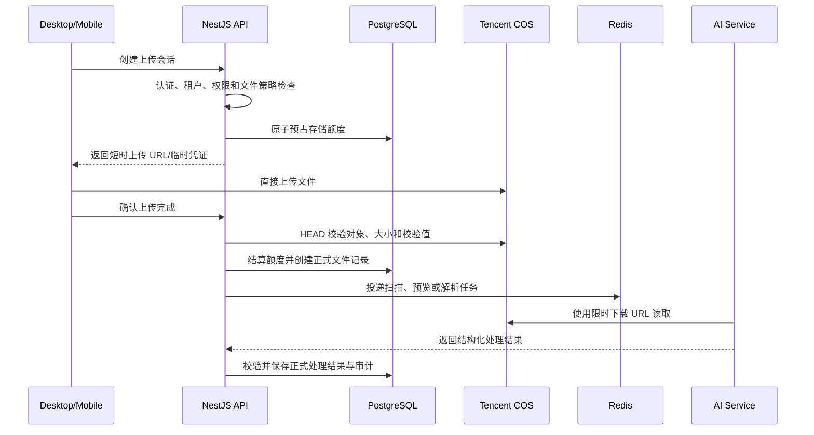

# 文件上传与 COS 设计

> 状态：基础单文件直传已于 2026-09-08 落地；权限、额度、分片、扫描、业务绑定和 AI 入库仍为后续设计。正式公开行为以当前 `packages/contracts/openapi/openapi.yaml` 为准。

## 1. 当前结论

- 已实现 `POST /api/v1/upload-sessions` 和 `POST /api/v1/upload-sessions/{uploadSessionId}/complete`，客户端通过短时预签名 PUT URL 直传 COS。
- 基础接口必须经过 JWT 认证并使用服务端建立的 TenantContext；客户端不能提交 `tenantId`、Bucket 或对象键。
- 当前暂不执行 `file.upload` 等细粒度权限和租户商业额度，因此有效租户内的登录成员均可使用基础上传接口；该限制必须在扩大生产使用范围前补齐。
- 基础接口仅支持普通附件、单文件上传和 100 MiB 默认技术上限，环境可以下调，上限硬限制为 500 MiB。
- 文件二进制存储在腾讯云 COS；正式文件元数据、租户归属、业务关联、额度和审计记录由 NestJS/PostgreSQL 管理。
- 客户端直接上传到 COS，NestJS 负责授权和签发短时上传凭证；AI 服务只使用限时下载 URL 或受控内容，不持有长期 COS 密钥。

## 2. COS 布局

当前资源：

```text
Bucket: cees-ai-1403013862
Region: ap-chengdu
```

Bucket 中使用以下顶层对象前缀：

```text
cees/
├── local/     # 本地开发区域
├── staging/   # 共享测试服务器区域
└── production/ # 生产区域
```

推荐的完整对象键：

```text
cees/{environment}/tenants/{tenantId}/files/{yyyy}/{mm}/{fileId}/source
```

例如：

```text
cees/local/tenants/11111111-1111-4111-8111-111111111111/files/2026/09/22222222-2222-4222-8222-222222222222/source
cees/staging/tenants/33333333-3333-4333-8333-333333333333/files/2026/09/44444444-4444-4444-8444-444444444444/source
cees/production/tenants/55555555-5555-4555-8555-555555555555/files/2026/09/66666666-6666-4666-8666-666666666666/source
```

`tenantId` 和 `fileId` 必须为 UUID。当前基础上传接口只签发上述 `source` 路径；自动化测试也必须使用独立测试租户和文件 UUID，不能自行插入额外路径层级。

原始文件名只保存在数据库中，不直接作为 COS 对象键。后续派生文件可放在同一 `fileId` 下：

```text
{fileId}/source
{fileId}/derived/preview.webp
{fileId}/derived/text.json
{fileId}/derived/pages/1.webp
```

对象键中的租户 ID 只用于组织、审计和权限收窄，不能替代 API 的租户授权校验。

## 3. 环境与凭据隔离

本地、Staging 和 Production 分别写入 `cees/local`、`cees/staging` 和 `cees/production`。同一个 Bucket 下的前缀隔离必须同时由 CAM 权限约束：

- 本地凭据只能访问 `cees/local/*`；
- Staging 凭据只能访问 `cees/staging/*`；
- 生产凭据只能访问 `cees/production/*`；
- 三套环境不得共享同一 SecretId/SecretKey；
- 长期凭据只注入 NestJS API，不注入桌面端、移动端或 AI 服务。

业务 API 使用 [通用 CAM 策略模板](../../infra/tencent-cos/cam-policy.example.json)。为三个环境分别复制一份，将资源中的 `<environment>` 替换为 `local`、`staging` 或 `production`；不能把三个环境前缀同时放入同一份实际策略。

COS 中的“文件夹”本质上是对象键前缀，因此仅依赖代码拼接前缀并不足以形成安全隔离。

## 4. 服务边界

| 组件 | 职责 |
| --- | --- |
| NestJS API | 当前负责认证、租户、上传会话、COS 签名、文件元数据和审计；后续增加细粒度权限、额度及业务关联 |
| 腾讯云 COS | 保存原始文件与派生二进制对象，不作为业务事实源 |
| PostgreSQL | 当前保存 FileObject、UploadSession 和审计；后续增加额度、关联及扩展状态 |
| Redis | 当前提供通用缓存、幂等、计数和短期协调基础；后续可承载上传限流及任务队列，不作为额度事实源 |
| AI Service | 使用限时 URL 读取已授权文件，返回提取、OCR、分类或切块结果，不直接创建正式文件记录 |
| Desktop/Mobile | 创建上传会话、直传 COS、上报完成状态，不决定租户、对象键或 ACL |

## 5. 完整体系目标流程

以下流程包含尚未落地的权限、额度、异步任务和 AI 处理，用于说明后续目标，不代表当前基础接口已经具备这些能力。当前已实现流程以第 6 节为准。



不推荐所有文件先经过 NestJS 再转发 COS。大文件代理上传会占用 API 带宽、连接数和内存，也不利于移动端断点续传。

建议上传模式：

- 小文件使用限定单一对象键的预签名 PUT URL；
- 大文件使用限定前缀、操作和有效期的 STS 临时凭证或分片签名；
- 契约从第一版保留 `uploadMode`，以便兼容 `single` 与 `multipart`。

## 6. 已实现的基础上传 API

以下路径已经写入 OpenAPI 0.9.0。响应由全局拦截器包装为 `{ success, data, requestId }`。

### 6.1 创建上传会话

```http
POST /api/v1/upload-sessions
Idempotency-Key: <client-generated-key>
```

请求示例：

```json
{
  "purpose": "attachment",
  "fileName": "项目方案.pptx",
  "contentType": "application/vnd.openxmlformats-officedocument.presentationml.presentation",
  "sizeBytes": 28377120
}
```

客户端不得提交 `tenantId`、Bucket、对象前缀、完整对象键或 ACL。

响应数据示例：

```json
{
  "uploadSessionId": "11111111-1111-4111-8111-111111111111",
  "fileId": "22222222-2222-4222-8222-222222222222",
  "purpose": "attachment",
  "uploadMode": "single",
  "status": "PENDING",
  "expiresAt": "2026-09-08T12:00:00Z",
  "upload": {
    "method": "PUT",
    "url": "temporary-signed-url",
    "headers": {
      "Content-Type": "application/pdf"
    }
  }
}
```

创建会话时必须完成：

1. 从服务端认证上下文取得用户和租户；
2. 校验基础附件类型和当前环境的技术大小上限；
3. 生成服务端控制的 UUID `fileId` 和规范 COS 对象键；
4. 签发只允许 PUT 单一对象键并绑定规范 Content-Type 的短时 URL；
5. 在 PostgreSQL 保存带幂等键、对象定位和过期时间的 UploadSession；
6. 记录上传会话创建审计事件。

同一成员使用同一 `Idempotency-Key` 和相同请求重试时复用原会话；同一幂等键用于不同文件元数据时返回 `409`。

### 6.2 完成上传

```http
POST /api/v1/upload-sessions/{uploadSessionId}/complete
```

完成请求只表示“客户端认为上传完成”。API 必须向 COS 查询并验证：

- 对象确实存在；
- 对象键与会话一致；
- 实际大小与会话声明值完全一致；
- COS 返回的 Content-Type 与会话声明一致；
- 会话尚未过期且未被完成过；
- 会话绑定的 Bucket、Region 和环境前缀仍与当前运行配置一致。

验证成功后才创建正式 `FileObject`；不匹配对象会被拒绝并尝试从 COS 删除。基础版本尚不执行内容嗅探、病毒扫描、额度结算或 AI 解析。

### 6.3 文件访问

建议后续提供：

```http
GET    /api/v1/files/{fileId}
POST   /api/v1/files/{fileId}/download-url
DELETE /api/v1/files/{fileId}
```

每次生成下载 URL 都必须重新校验租户与业务资源权限。Bucket 保持私有，不能把永久公共 URL 作为业务字段。

## 7. 文件用途与支持类型

文件是否“允许存储”和是否“允许 AI 解析”必须分别判断。

当前基础版本只接受 `purpose=attachment`，支持 PDF、DOCX、XLSX、PPTX、JPEG、PNG、WebP、TXT、Markdown、CSV 和 JSON。下表中的其他用途及处理流程尚未开放。

| 用途 | v1 建议格式 | 处理方式 |
| --- | --- | --- |
| `avatar` | JPEG、PNG、WebP | 校验尺寸并生成缩略图 |
| `scanned_document` | JPEG、PNG、PDF | 异步 OCR，受套餐能力控制 |
| `attachment` | PDF、现代 Office、图片、纯文本 | 可以只保存，不强制进入 AI |
| `data_import` | CSV、XLSX、JSON | 独立的数据导入校验流程，不按普通附件处理 |

当前明确支持 `.pptx`、`.docx` 和 `.xlsx`；旧式 `.ppt`、`.doc`、`.xls` 暂不开放。后续若允许旧格式作为普通附件保存，也不能在受隔离的格式转换能力完成前承诺 AI 解析。

第一版不建议开放：

- EXE、DLL、APK 等可执行文件；
- ZIP、RAR、7Z 等压缩包；
- 未清洗的 HTML、SVG；
- DOCM、XLSM、PPTM 等带宏格式；
- 音频、视频；
- 密码保护且无法检查内容的 PDF/Office 文件。

服务端必须基于文件头重新识别实际类型，不能只信任扩展名和客户端 Content-Type。还应限制 PDF 页数、PPT 页数、Excel 单元格数、图片像素和 Office 内嵌媒体大小。

建议初始技术上限：

| 类别 | 默认上限 |
| --- | ---: |
| 头像 | 5 MiB |
| 普通图片/OCR 图片 | 20 MiB |
| TXT、Markdown、CSV | 20～50 MiB |
| PDF、DOCX、PPTX、XLSX | 100 MiB |
| 系统硬上限 | 500 MiB |

这些数值属于技术安全默认值，商业套餐可以进一步降低或在经过容量验证后提高。

## 8. 数据与状态模型

当前已实现：

```text
UploadSession         上传会话、幂等键、预期元数据、COS 定位和过期时间
FileObject            通过 COS HEAD 校验后的正式文件元数据
```

`UploadSession.status` 当前为：

```text
PENDING / COMPLETED / EXPIRED / FAILED
```

正式 `FileObject` 只在完成校验后创建，因此基础版本无需再维护一个“待验证文件”状态。以下概念随完整上传体系继续实现：

```text
StorageReservation    并发上传的额度预占
TenantStorageUsage    租户已用和已预占字节数
FileBinding           文件与业务资源的关联
TenantEntitlement     套餐最终计算出的有效权益
```

状态不要全部塞进单一字段：

```text
FileAsset.status:
VERIFYING / ACTIVE / REJECTED / DELETING / DELETED

scanStatus:
PENDING / CLEAN / INFECTED / FAILED

ingestionStatus:
NOT_REQUESTED / QUEUED / PROCESSING / READY / FAILED
```

这样可以正确表达“文件已上传，但安全扫描或 AI 解析失败”。

## 9. 套餐、坑位价格与存储额度

上传服务不直接理解价格，而是读取租户已经生效的权益：

```text
effectiveLimitBytes =
  planBaseBytes
  + activeSeatCount * bytesPerSeat
  + purchasedAddOnBytes
```

上传额度判断：

```text
usedBytes + reservedBytes + requestedBytes <= effectiveLimitBytes
```

额度处理必须在 PostgreSQL 中原子执行：

1. 创建上传会话时按客户端声明大小预占额度；
2. 上传完成后以 COS 返回的实际大小结算；
3. 会话过期或失败时释放预占；
4. 删除文件时，COS 物理删除成功后再释放正式额度；
5. 定时使用 COS 清单或前缀扫描核对数据库账本，发现孤儿对象和计量偏差。

套餐降级导致现有用量超过新额度时，建议保留已有文件的读取能力，但阻止新上传，并提供宽限期或扩容入口。

建议用户可见额度计算原始上传文件和用户明确保存的导出文件。缩略图、OCR 中间结果和提取文本等系统派生数据应单独统计运营成本，避免用户上传一个文件后看到难以解释的额度增长。

## 10. 权限与审计前置条件

基础接口已经具备 JWT、TenantContext、对象键租户隔离和审计，但暂未引入下列细粒度权限：

```text
file.upload
file.read
file.delete
file.manage
```

当前必须满足：

- 用户身份已经认证；
- TenantContext 由服务端建立，不接受客户端 tenantId 作为授权依据；
- 创建、完成、元数据拒绝和会话过期均记录审计事件；
- 日志不得记录 SecretId、SecretKey 或完整签名 URL。

在文件绑定具体业务资源或面向正式生产用户开放前，还必须增加 `file.upload/read/delete/manage` 权限、资源数据范围和租户额度控制。

## 11. 实施顺序

### 已完成的基础准备

1. 补充 COS 的 `cees/local`、`cees/staging`、`cees/production` 前缀约定；
2. 为三套环境创建独立、按前缀收窄的 CAM 策略模板；
3. 在 OpenAPI 0.9.0 定义创建和完成上传会话；
4. 实现 `StorageProvider`、腾讯云 COS 适配器和规范对象键生成器；
5. 实现 UploadSession、FileObject 元数据与 `0004_redis_cos_upload_foundation` 迁移；
6. 实现 JWT/TenantContext 保护、幂等创建、COS HEAD 校验和基础审计；
7. 为对象键、签名参数、元数据校验和异常路径增加单元测试。

### 下一步实施

1. 增加 `file.upload/read/delete/manage` 权限和资源范围；
2. 定稿套餐额度并实现 PostgreSQL 原子预占与释放；
3. 增加文件详情、下载签名、删除和业务绑定接口；
4. 增加孤儿对象清理、内容嗅探、安全扫描和对账；
5. 根据客户端需求实现分片上传和断点续传。

### 扩大生产使用范围前的条件

- OpenAPI 契约和客户端生成物持续一致；
- `file.*` 权限检查接口可用；
- 额度能够事务性预占和释放；
- 审计服务可用；
- COS 凭据已按 local/staging/production 前缀隔离。

### 后续能力

- 分片上传和断点续传；
- 病毒扫描、内容安全和隔离区；
- Office/PDF 预览与 OCR；
- 文件版本、保留期和回收站；
- COS 用量对账、告警和成本分析。

## 12. 待确认事项

- 各套餐基础额度、每坑位额度和单文件上限；
- 系统派生文件是否进入商业计费；
- 是否需要第一版即支持移动端断点续传；
- 安全扫描采用腾讯云能力、自建扫描服务还是组合方案；
- 旧式 Office、音视频和压缩包的产品优先级；
- 文件删除后的保留期，以及保留期内是否继续计入额度。
