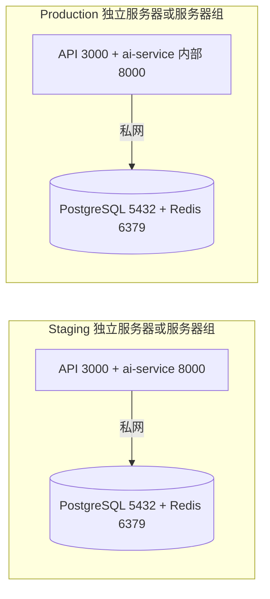
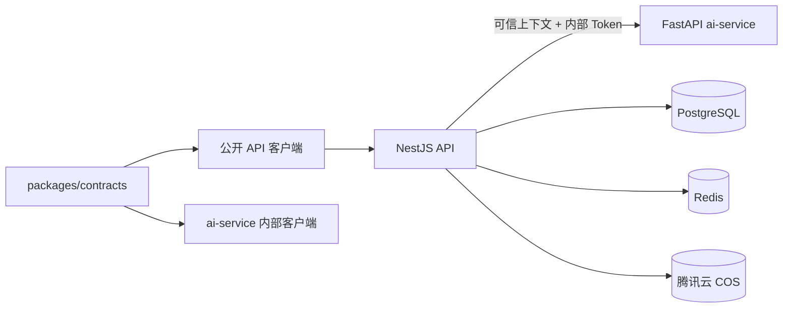

# 总体架构

## 仓库结构

```text
cees_ai/
├── apps/
│   ├── api/                    # NestJS 业务事实源
│   ├── ai-service/             # FastAPI 通用 AI 基础设施
│   ├── desktop/                # Electron + React 桌面端
│   └── mobile/                 # Flutter 移动端
├── packages/
│   ├── contracts/              # 公开与内部 OpenAPI 契约
│   ├── api-client/             # 公开 API TypeScript 客户端
│   ├── ai-service-client/      # 内部 AI Service 生成客户端
│   ├── ui-kit/
│   └── config/
├── infra/                      # 分离式应用、数据库部署与腾讯云 COS 配置
└── docs/
```

## 边界与职责

- NestJS 是 Tenant、User、Permission、业务资源、正式写入和审计数据的唯一事实源。
- ai-service 当前只提供 health、ready 和受内部 Token 保护的通用 LLM invoke，不定义工作记录、会议、知识库或管理简报等业务能力。
- ai-service 不直接连接业务数据库，不创建或修改正式业务数据。
- 未来业务 AI 功能必须由 NestJS 建立可信租户/用户上下文，并在契约中定义专用输入输出，不能让客户端直接调用通用 invoke。
- COS 长期凭据只由 NestJS 持有；客户端和 ai-service 不持有长期 COS 密钥。
- 客户端上传文件时只获取绑定单一规范对象键的短时 COS URL；正式文件记录由 NestJS 在 HEAD 校验后写入 PostgreSQL。
- Redis 仅承载缓存、幂等、计数和短期协调数据，所有调用键自动加环境前缀，不能替代 PostgreSQL 业务事实。
- 桌面端和移动端中的部分菜单仍是 UI 原型，占位入口不构成后端需求或可用能力。
- 本地开发在开发电脑运行 PostgreSQL/Redis；Staging 与 Production 分别部署在独立服务器或服务器组，不共享宿主机端口。
- Staging 与 Production 通过独立主机、Compose 项目、容器、网络、数据卷和 Secret 隔离；两套环境统一使用服务标准端口。
- 连接地址和密钥只来自未提交的环境文件或平台 Secrets。

## 物理部署拓扑



Staging 与 Production 不部署在同一宿主机，因此 API、PostgreSQL 和 Redis 均使用容器内外一致的标准端口。Staging ai-service 使用 `8000:8000` 对外提供受控调试文档；Production ai-service 不映射宿主机端口。应用服务器运行目录只包含环境配置、模型配置、Compose 和部署脚本，不要求 clone 业务源码。应用镜像由开发电脑构建后上传 COS，服务器校验并通过 `docker image load` 导入。
## 契约与调用链路



跨语言行为只通过 `packages/contracts` 对齐。生成目录不得手改，契约变更必须运行 `contracts:lint`、`contracts:gen` 和 `contracts:check`。

## 专题设计

- [AI Service 通用基础设施](ai-service-foundation.md)
- [通用文档生成](document-generation.md)
- [文件上传与 COS 设计](file-upload.md)
- [Redis 基础能力](redis-foundation.md)
