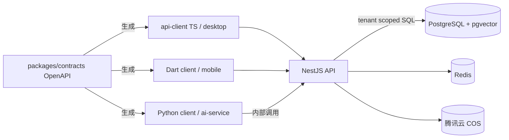

# 总体架构

## 最终目录树

```text
cees_ai/
├── apps/
│   ├── api/                    # NestJS 业务事实源（认证、租户、RBAC、写入、审计）
│   ├── ai-service/             # FastAPI AI 服务（草稿、建议、RAG）
│   ├── desktop/                # Electron + React 桌面端
│   └── mobile/                 # Flutter 移动端（独立 pubspec，不参与 pnpm）
├── packages/
│   ├── contracts/              # OpenAPI：全仓唯一跨语言契约
│   ├── api-client/             # 由 contracts 生成的 TS 客户端
│   ├── ui-kit/                 # 共享 React 组件
│   └── config/                 # 共享 tsconfig 等工程配置
├── infra/
│   ├── docker-compose.yml
│   ├── docker-compose.dev.yml  # 开发环境覆盖
│   ├── docker-compose.test.yml # 测试环境覆盖
│   ├── docker-compose.prod.yml # 生产环境覆盖
│   ├── docker/                 # 代理/附加镜像与补充配置
│   ├── scripts/
│   └── tencent-cos/            # 腾讯云 COS 与 CAM 配置说明
├── docs/
│   ├── architecture/
│   ├── api/
│   ├── database/
│   ├── product/
│   └── security/
├── .env.example
├── AGENTS.md
├── README.md
├── package.json
└── pnpm-workspace.yaml
```

## 边界与职责

- NestJS 是 Tenant、User、Permission、业务资源和审计数据的唯一事实源，负责认证与数据范围校验。
- FastAPI 不创建或修改正式业务数据，只返回经过 Schema 校验的草稿、建议与检索结果；所有 AI 草稿必须由用户确认，再由 NestJS 执行正式写入。
- 知识库原文件存储于私有腾讯云 COS，元数据与向量位于 PostgreSQL/pgvector。
- COS 长期凭据只由 NestJS 持有；AI 服务通过可信上下文中的限时签名 URL 或受控内容访问文件。
- Electron 桌面端与 Flutter 移动端都是客户端，共享同一份 API 契约；业务状态机只存在于服务端。
- Docker 环境采用公共 Compose 与 dev/test/prod 覆盖文件组合；连接地址和密钥由各环境变量或平台 Secrets 注入，不写死 IP。

## 契约链路



## 工具链与 CI 路径

- pnpm workspace：`apps/api`、`apps/desktop`、`packages/*`，共享锁文件与构建缓存。
- Python：`apps/ai-service` 独立依赖环境；Flutter：`apps/mobile` 独立 pubspec。
- CI 按路径触发：改 `packages/contracts` 时全端契约验证；改单个 app 只跑对应端验证。

## 专题设计

- [文件上传设计草案](file-upload.md)：腾讯云 COS、上传会话、租户权限、文件类型、状态与存储额度。
